# 🤖 n8n 기반 알고리즘 스터디 자동화 (Algorithm Study Automation)

> **"문제 추천부터 풀이 인증, 대시보드 동기화까지 — 사람의 개입을 최소화한 자동화 워크플로우"**

<br/>

---

## 🧑‍💻 팀원 소개


|  |  |  |
|:---:|:---:|:---:|
| **심규보**<br>[@Qbooo](https://github.com/Qbooo) | **양규리**<br>[@ygreee0320](https://github.com/ygreee0320) | **이준호**<br>[@Junhoss](https://github.com/Junhoss) |

<br/>


## 1. 🎯 프로젝트 소개
이 프로젝트는 **n8n**을 활용한 **이벤트 기반(Event-Driven) 알고리즘 스터디 관리 시스템**입니다.

매일 아침 사용자의 수준에 맞는 적절한 알고리즘 문제를 자동으로 추천받고, 문제를 풀어 GitHub에 Push 하면 별도의 조작 없이 Notion 대시보드의 상태가 업데이트되고 Slack 알림이 전송됩니다. 반복적인 스터디 관리 업무를 **100% 자동화**하여, 사용자가 '문제 풀이'라는 본질적인 학습 활동에만 집중할 수 있는 환경을 구축했습니다.

### ✨ 주요 기능
* **오늘의 추천 문제 발송:** 매일 오전 9시, `Solved.ac` API를 통해 수준에 맞는 문제를 랜덤 추천 및 Slack 발송.
* **Interactive Action:** Slack 메시지 내 버튼(수락/거절)을 통해 원클릭으로 Notion 학습 계획표에 문제 등록 (Webhook 활용).
* **깃허브 커밋 감지 및 알림/Notion 동기화:** `BaekjoonHub`를 통한 GitHub Commit 감지 → Notion 페이지 상태 '완료' 자동 변경 → 풀이 링크 동기화.

---
## 2. 💡 기획 배경
취업 준비 과정에서 꾸준한 알고리즘 학습을 위해 스터디를 진행했으나, 학습 외적인 부분에서 비효율이 발생함을 느꼈습니다.

1.  **의사결정 비용 (Decision Fatigue):** 매일 수많은 문제 중 어떤 것을 풀지 고민하는 데 불필요한 시간이 소요됨.
2.  **관리의 번거로움 (Admin Overhead):** 문제를 풀 때마다 Notion에 접속해 제목, 링크, 난이도를 기록하고 체크박스를 갱신하는 과정이 번거로워 기록을 누락하게 됨.
3.  **지속성 저하 (Consistency):** 강제성이 부족하고 피드백 루프가 느려 작심삼일로 끝나는 경우가 많음.

이러한 문제를 해결하기 위해 <b>"홈 서버 Docker 환경에서 구동되는 n8n을 이용해, 이기종 애플리케이션(GitHub, Notion, Slack)이 유기적으로 데이터를 주고받는 자동화 파이프라인"</b>을 설계하게 되었습니다. 이를 통해 단순 반복 업무를 제거하고, 데이터 기반으로 학습 현황을 투명하게 관리하고자 했습니다.

## 3. 🛠️ 기술 스택

### 🔹 Workflow & Automation
 

 

* **n8n (Self-Hosted):** Docker 컨테이너 기반으로 직접 구축하여 데이터 보안성과 커스터마이징 유연성 확보.
* **Docker**: Docker Compose를 활용한 n8n 서비스 구성 및 재배포를 통해 안정적인 자동화 환경 구축.
* **Linux**: Linux 서버 환경에서 컨테이너 운영, 로그 관리 및 기본적인 서버 설정·운영 수행.
* **JavaScript (ES6):** Function Node 및 Expression을 활용한 복잡한 JSON 데이터 파싱 및 정규식 처리.


### 🔹 Integrations (API)
  
* **Solved.ac API:** 문제 정보(난이도, 태그 등) 조회.
* **Notion API:** 데이터베이스 페이지 생성(Create), 조회(Query), 속성 업데이트(Patch).
* **Slack API (Block Kit):** 인터랙티브 버튼이 포함된 메시지 UI 구성 및 Webhook 연동.

---

## 4. 🏗️ 시스템 아키텍처

전체 시스템은 <b>'문제 추천(Morning Routine)</b>과 <b>'풀이 인증(Solving Routine)'</b>의 두 가지 주요 워크플로우로 구성되어 있습니다.
<br>
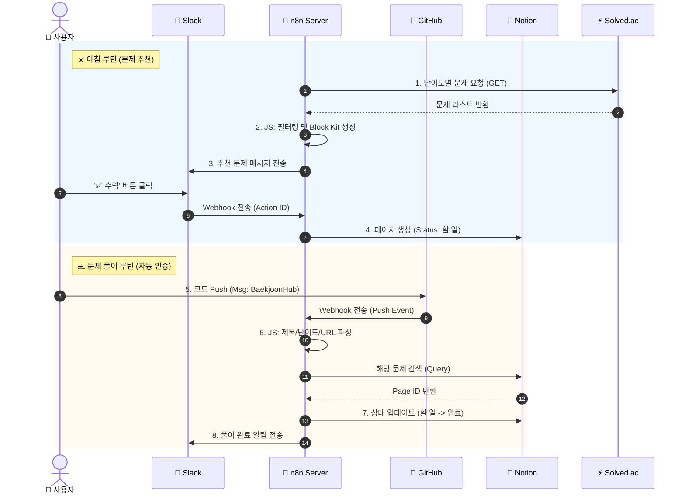

<br>

## 5. ⚙️ 워크플로우
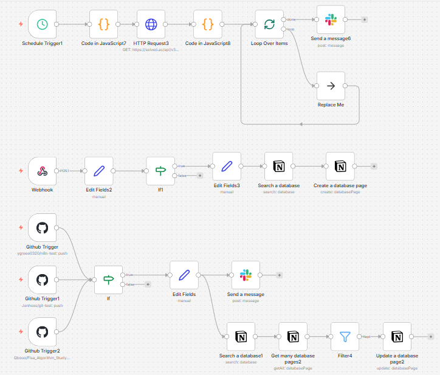
<br>

### 1️⃣ 📅 Solved.ac API 기반 문제 추출 파이프라인
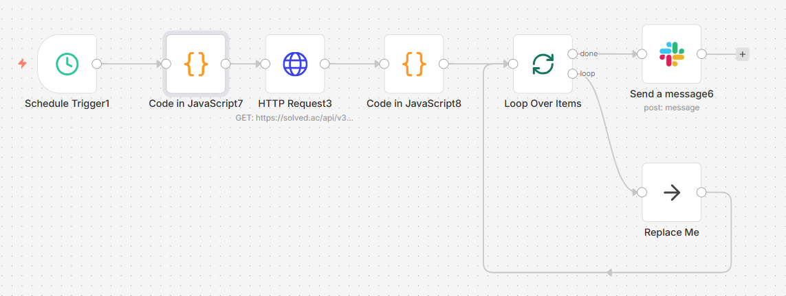

`Schedule Trigger` → `HTTP Request` → `Code` → `Slack` 정해진 스케줄에 맞춰 외부 API로부터 알고리즘 데이터를 수집하고 가공하여 메신저로 전송하는 워크플로우입니다.

- **Schedule Trigger**: Cron 표현식을 사용하여 매일 오전 09:00에 워크플로우를 시작합니다.

- **HTTP Request**: Solved.ac API에 GET 요청을 보내 특정 난이도(Gold 1 ~ )의 문제 데이터를 받아옵니다.

- **Code (JavaScript)**: 응답받은 JSON 데이터에서 무작위로 문제를 선별하고, Slack Block Kit 형식에 맞게 메시지 페이로드를 동적으로 생성합니다.

- **Loop Over Items**: 다수의 문제가 추출될 경우를 대비해 데이터를 순회하며 개별 메시지 객체를 생성합니다.

- **Slack (Send Message)**: 최종 가공된 메시지를 Slack 채널로 전송하여 사용자에게 알림을 보냅니다.
<br>

### 2️⃣ ⚡ Slack 인터랙티브 웹훅 처리
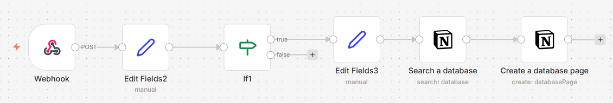

`Webhook` → `If (Switch)` → `Notion Create` Slack 버튼 클릭 시 발생하는 이벤트를 수신하여 Notion 데이터베이스를 제어하는 로직입니다.

- **Webhook (POST)**: Slack에서 발생하는 인터랙션 이벤트(버튼 클릭)를 수신하는 엔드포인트입니다.

- **If (Condition)**: 수신된 Payload의 Action ID를 분석하여 사용자가 '수락'을 눌렀는지 '거절'을 눌렀는지 분기 처리합니다.

- **Edit Fields**: Notion API가 요구하는 포맷에 맞춰 데이터 필드(제목, URL, 태그 등)를 매핑합니다.

- **Notion (Create Page)**: 사용자가 문제를 수락한 경우, 해당 문제 정보를 Notion Database에 새로운 페이지로 자동 생성합니다.
<br>

### 3️⃣ 🐙 다중 리포지토리 커밋 감지 및 DB 동기화
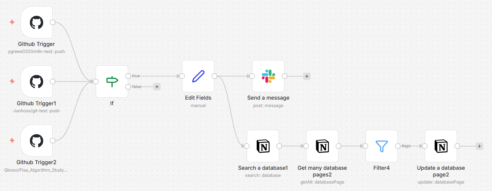

`GitHub Trigger (Multi)` → `Filter` → `Notion Update` 여러 GitHub 리포지토리의 Push 이벤트를 감지하여, 문제 풀이 여부를 Notion에 자동으로 반영합니다.

- **GitHub Trigger**: 스터디원들의 리포지토리를 동시에 리스닝하며 Push 이벤트를 감지합니다.

- **If (Validation)**: 커밋 메시지를 분석하여 BaekjoonHub와 같은 특정 키워드가 포함된 유효한 풀이 제출인지 검증합니다.

- **Notion (Search & Get)**: 커밋된 문제 제목을 Key로 사용하여 Notion 데이터베이스를 검색하고, 기존에 등록된 문제 페이지의 ID를 조회합니다.

- **Notion (Update Page)**: 검색된 페이지의 상태 속성을 '진행 중'에서 '완료'로 변경하고, 커밋 링크를 업데이트하여 풀이 이력을 동기화합니다.

<br>

## 6. ⚡ 실행

### 1️⃣ 🎲 맞춤형 문제 추천 & 알림
매일 아침, 사용자의 학습 단계에 맞는 문제를 자동으로 선별하여 제공합니다.

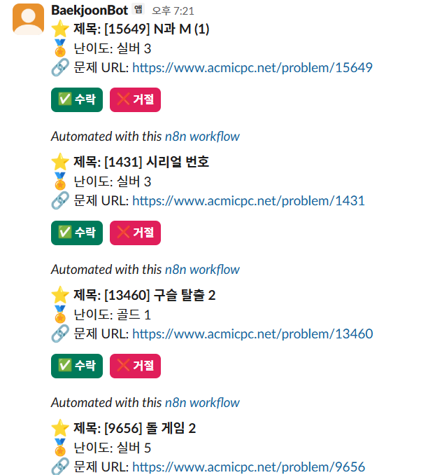
<br>

### 2️⃣ 🖱️ 인터랙티브 학습 관리
1. 추천 메시지의 '✅ 수락' 버튼을 클릭하면, `POST` 요청을 n8n `Webhook`이 수신합니다. 

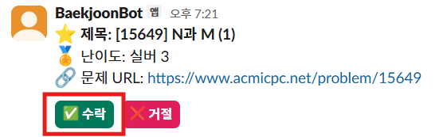

2. 이후, Notion API를 호출하여 진행할 알고리즘 문제 페이지를 자동 생성합니다.

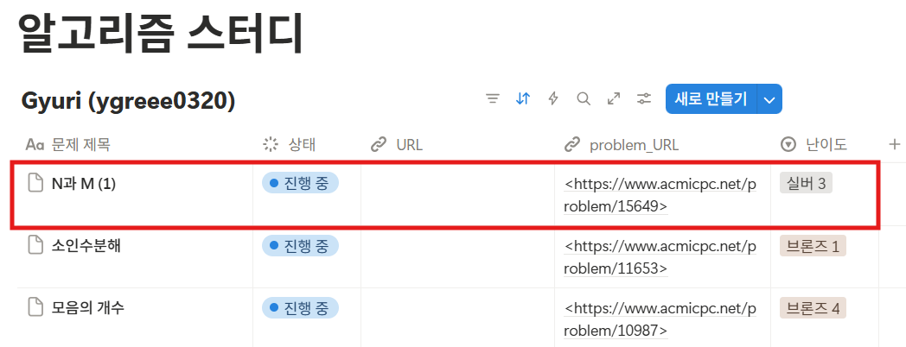
<br>

### 3️⃣ 🔄 풀이 검증 및 동기화
1. 수락한 추천 문제를 풀고 제출합니다.

 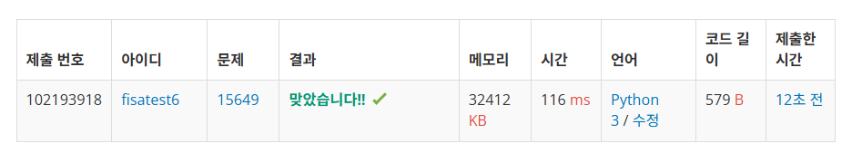

2. 백준 허브를 통해 GitHub Push 이벤트가 실행되면, `Github Trigger`가 이를 받아 커밋 메시지를 분석합니다.

 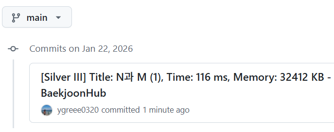

3. 커밋 메시지 문자열을 분석하여 `문제 제목`, `Author` 정보를 추출합니다. 추출된 제목을 기반으로 Notion 데이터베이스를 검색하고, 일치하는 페이지의 상태를 <b>'진행 중' → '완료'</b>로 변경하며 커밋 URL을 자동으로 기입합니다.

 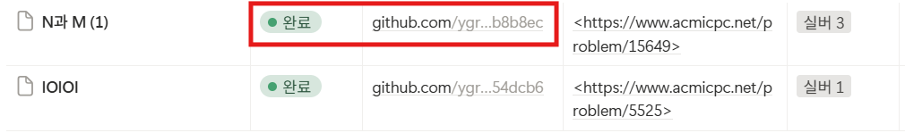
<br><br>


## 7. 🚀 트러블 슈팅

### 🚨 이슈 1 : GitHub Webhook(Commit Push) 이벤트 수신 불가

#### 1. 문제 상황 (Problem)
로컬 환경(Docker)에서 n8n을 실행하고, GitHub 리포지토리에 코드가 푸시(Push)될 때마다 자동으로 워크플로우가 실행되도록 `GitHub Trigger` 노드를 설정했습니다.
하지만 실제 로컬에서 `git push`를 수행해도 **n8n에서 아무런 반응이 없었으며**, GitHub 리포지토리의 Webhook 설정 페이지에서는 `Delivery Error (Connection refused)`가 발생했습니다.

* **설정 시도:** Webhook Payload URL에 `http://localhost:5678/webhook/...`을 입력했으나 GitHub가 접근하지 못함

#### 2. 원인 분석 (Cause)
* **네트워크 격리:** GitHub 서버는 공용 인터넷(Public Network)에 위치해 있지만, 내 n8n 서버는 내 컴퓨터의 사설망(Private Network, `localhost`) 내부에 갇혀 있습니다.
* **접근 불가:** 외부 서비스인 GitHub 입장에서는 내 컴퓨터의 IP 주소를 알 수도 없고, 방화벽 등에 막혀 직접 접근(Inbound Request)할 수 없습니다. 즉, `localhost`라는 주소는 GitHub 서버 입장에서 유효하지 않은 주소입니다.

#### 3. 해결 방법: ngrok을 이용한 터널링
로컬 포트를 외부 인터넷에 안전하게 노출시켜주는 터널링 도구 **ngrok**을 도입하여, GitHub가 내 로컬 서버로 데이터를 보낼 수 있는 공용 터널을 생성했습니다.

- **1) ngrok 설치 및 실행**
n8n이 실행 중인 로컬 포트(5678)를 외부와 연결합니다.

    ```bash
    ngrok http 5678
    ```
    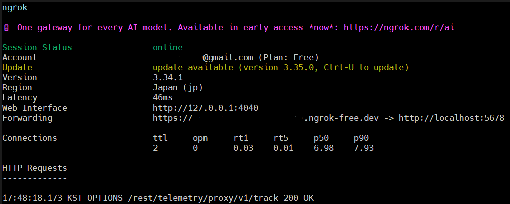

- **2) 퍼블릭 URL 확보**
ngrok 실행 후 생성된 고유의 Forwarding URL을 확보했습니다.

- **3) GitHub Webhook 설정 업데이트**
    - Payload URL을 기존 localhost 주소에서 ngrok이 발급해 준 주소로 변경

#### 4. 결과
- git push 발생 시, GitHub가 ngrok 터널을 통해 로컬 n8n으로 Webhook 이벤트(JSON Payload)를 정상적으로 전송
- n8n의 GitHub Trigger 노드가 즉시 반응하여, 이후 연결된 자동화 로직(Slack 알림, Notion Update)이 성공적으로 수행
