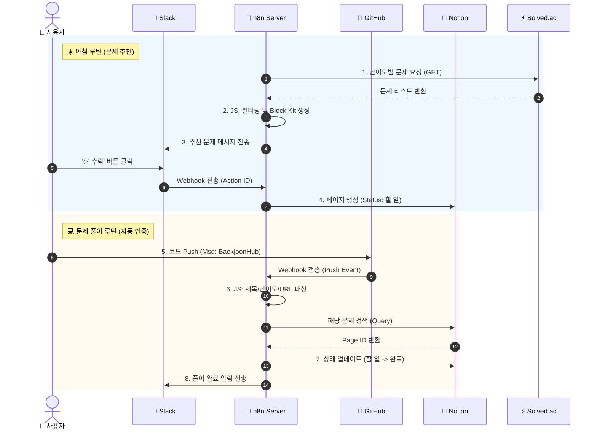

# 🤖 n8n 기반 알고리즘 스터디 자동화 (Algorithm Study Automation)

> **"문제 추천부터 풀이 인증, 대시보드 동기화까지 — 사람의 개입을 최소화한 자동화 워크플로우"**

 

---

## 🧑‍💻 팀원 소개

|  |  |  |
|:---:|:---:|:---:|
| **심규보** [@Qbooo](https://github.com/Qbooo) | **양규리** [@ygreee0320](https://github.com/ygreee0320) | **이준호** [@Junhoss](https://github.com/Junhoss) |

 

## 1. 🎯 프로젝트 소개 (Introduction)
이 프로젝트는 **n8n**을 활용한 **이벤트 기반(Event-Driven) 알고리즘 스터디 관리 시스템**입니다.

매일 아침 사용자의 수준에 맞는 적절한 알고리즘 문제를 자동으로 추천받고, 문제를 풀어 GitHub에 Push 하면 별도의 조작 없이 Notion 대시보드의 상태가 업데이트되고 Slack 알림이 전송됩니다. 반복적인 스터디 관리 업무를 **100% 자동화**하여, 사용자가 '문제 풀이'라는 본질적인 학습 활동에만 집중할 수 있는 환경을 구축했습니다.

### ✅ 핵심 기능 (Key Features)
* **오늘의 추천 문제 발송:** 매일 오전 9시, `Solved.ac` API를 통해 현재 수준(Silver 3~5)에 맞는 문제를 랜덤 추천 및 Slack 발송.
* **Interactive Action:** Slack 메시지 내 버튼(수락/거절)을 통해 원클릭으로 Notion 학습 계획표에 문제 등록 (Webhook 활용).
* **깃허브 커밋 감지 및 알림/Notion 동기화:** `BaekjoonHub`를 통한 GitHub Commit 감지 → Notion 페이지 상태 '완료' 자동 변경 → 풀이 링크 동기화.

---
## 2. 💡 기획 배경 (Motivation)
취업 준비 과정에서 꾸준한 알고리즘 학습(PS)을 위해 스터디를 진행했으나, 학습 외적인 부분에서 비효율이 발생함을 느꼈습니다.

1.  **의사결정 비용 (Decision Fatigue):** 매일 수많은 문제 중 어떤 것을 풀지 고민하는 데 불필요한 시간이 소요됨.
2.  **관리의 번거로움 (Admin Overhead):** 문제를 풀 때마다 Notion에 접속해 제목, 링크, 난이도를 기록하고 체크박스를 갱신하는 과정이 번거로워 기록을 누락하게 됨.
3.  **지속성 저하 (Consistency):** 강제성이 부족하고 피드백 루프가 느려 작심삼일로 끝나는 경우가 많음.

이러한 문제를 해결하기 위해 **"홈 서버 Docker 환경에서 구동되는 n8n을 이용해, 이기종 애플리케이션(GitHub, Notion, Slack)이 유기적으로 데이터를 주고받는 자동화 파이프라인"**을 설계하게 되었습니다. 이를 통해 단순 반복 업무를 제거하고, 데이터 기반으로 학습 현황을 투명하게 관리하고자 했습니다.

## 3. 🛠️ 기술 스택 (Tech Stack)

### 🔹 Workflow & Automation

* **n8n (Self-Hosted):** Docker 컨테이너 기반으로 직접 구축하여 데이터 보안성과 커스터마이징 유연성 확보.
* **JavaScript (ES6):** Function Node 및 Expression을 활용한 복잡한 JSON 데이터 파싱 및 정규식 처리.

### 🔹 Integrations (API)
  
* **Solved.ac API:** 문제 정보(난이도, 태그 등) 조회.
* **Notion API:** 데이터베이스 페이지 생성(Create), 조회(Query), 속성 업데이트(Patch).
* **Slack API (Block Kit):** 인터랙티브 버튼이 포함된 메시지 UI 구성 및 Webhook 연동.

---

## 4. 🏗️ 시스템 아키텍처 (System Architecture)

전체 시스템은 **'문제 추천(Morning Routine)'**과 **'풀이 인증(Solving Routine)'**의 두 가지 주요 워크플로우로 구성되어 있습니다.
 

   

## 5. ✨ 주요 기능 상세 (Key Features)

### 1️⃣ 🎲 맞춤형 문제 추천 & 알림 (Daily Smart Recommendation)
매일 아침, 사용자의 학습 단계에 맞는 문제를 자동으로 선별하여 제공합니다.
* **API Integration:** `Solved.ac` API를 호출하여 `Tier: Silver 5 ~ Silver 3` 난이도의 문제를 무작위로 추출합니다.
* **Scheduling:** n8n의 `Cron/Schedule` 노드를 통해 매일 09:00에 트리거됩니다.
* **User Experience:** 단순 텍스트가 아닌 Slack Block Kit을 활용하여 문제 제목, 난이도, 링크를 시각적으로 구조화해 전송합니다.

### 2️⃣ 🖱️ 인터랙티브 학습 관리 (Interactive Study Management)
Slack에서 노션으로 이어지는 Context Switching을 제거하기 위해, 메신저 내에서 데이터베이스 조작이 가능하도록 구현했습니다.
* **Interactive Buttons:** 추천 메시지에 '✅ 수락', '❌ 거절' 버튼을 부착하여 사용자 행동을 유도합니다.
* **Webhook Event Handling:** 버튼 클릭 시 발생하는 `POST` 요청을 n8n Webhook이 수신합니다.
* **Data Routing:** `Switch` 노드를 통해 Action ID(`action_approve`)를 판별하고, 수락 시 Notion API를 호출하여 '할 일(To-Do)' 페이지를 자동 생성합니다.

### 3️⃣ 🔄 풀이 검증 및 동기화 (Automated Verification & Sync)
문제 풀이 후 별도의 기록 과정 없이, 코드 제출만으로 학습 상태를 동기화합니다.
* **Pattern Matching:** GitHub Push 이벤트 중 커밋 메시지에 `BaekjoonHub` 키워드가 포함된 경우에만 워크플로우가 실행됩니다.
* **Data Parsing:** 커밋 메시지 문자열을 분석(Split/Regex)하여 `문제 제목`, `난이도`, `풀이 자(Author)` 정보를 추출합니다.
* **DB Update:** 추출된 제목을 기반으로 Notion 데이터베이스를 검색(Query)하고, 일치하는 페이지의 상태를 **'진행 중' → '완료'**로 변경하며 커밋 URL을 자동으로 기입합니다.

   

## 6. 🚀 트러블 슈팅 (Troubleshooting)
